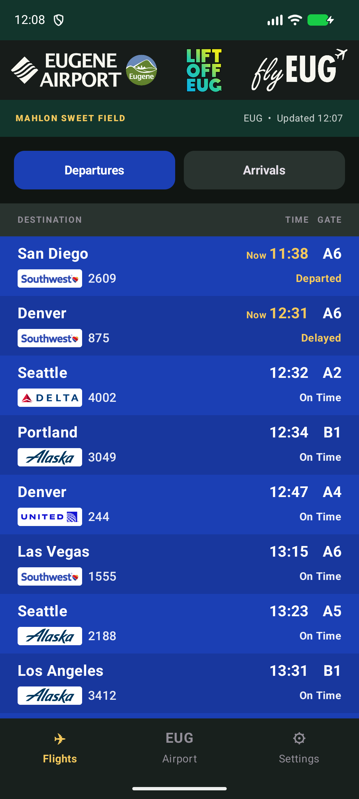
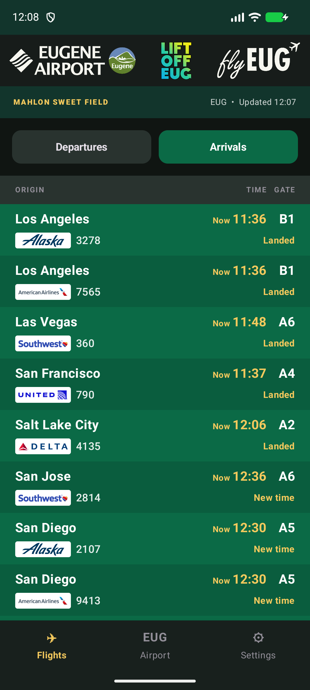
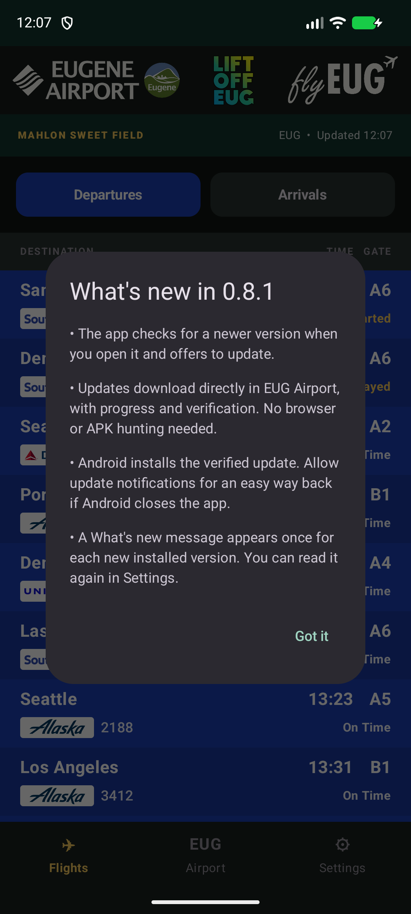

# Eugene Airport Android app

A free, unofficial Eugene Airport companion with live arrivals, departures, airport
information, and food and drink menus.

**[Download EUG Airport 0.8.1 control build](https://github.com/Brusko25/Eugene-Airport-Releases/releases/download/v0.8.1/EUG-Airport-v0.8.1-debug.apk)**

> **Latest: 0.8.1 control build — physical-phone verification pending.** This contains
> the 0.8 app with only version identifiers changed, to test its in-app update path.
> It is an investigation build, not a confirmed fix. The previously verified
> [0.8.0 download](https://github.com/Brusko25/Eugene-Airport-Releases/releases/tag/v0.8.0)
> remains available. Version 0.9 is still withdrawn following its Play Protect block.

## Screenshots

Actual EUG Airport 0.8.1 running in an Android emulator. These previews do not establish
physical-phone Play Protect acceptance. Flight details and times can change. Click an
image to see it full size. The What's new bullets intentionally repeat 0.8's features.

| Departures | Arrivals |
| --- | --- |
|  |  |

| Airport guide | What's new |
| --- | --- |
|  |  |

## Install on your Android phone

1. Tap the download link on your Android phone.
2. When it finishes, open the downloaded file.
3. If Android asks, allow your browser to install this app, then tap **Install**.
4. Open **EUG Airport**.

Already have it? Install the update over the existing app; you do not need to uninstall.
These are debug-signed testing builds for Android 8.0 and newer, distributed outside
Google Play. Follow any Android installation or security prompts.

## Updates and What's new

Versions **0.8 and newer** check for a newer release when you open the app. Tap **Update** to
download it inside EUG Airport, then follow any Android confirmation screens. On first
use Android asks you to allow EUG Airport to install its updates. Update notifications
are optional; they provide an easy way to reopen the app if Android closes it.

What's new appears once after each new version is installed. You can read it again
under **Settings → App updates → What's new**.

If you still have **0.6 or 0.7**, use **Settings → App updates** to download 0.8 through
your browser once. Future updates initiated from 0.8 can use the new in-app flow.

[Latest release and notes](https://github.com/Brusko25/Eugene-Airport-Releases/releases/latest)

> This is an unofficial prototype. Always confirm flight information with your airline.

## Previous versions and source

[Browse every release](RELEASES.md). Versions 0.3.0 and 0.4.0 have historical notes
only; their original releases did not include APKs. Versions 0.4.1 and newer include
Android downloads.

This public repository contains releases and documentation. Application source is
maintained separately in the private `Eugene-Airport-Code` repository. To install,
choose an APK. GitHub's automatic Source code ZIP and tar.gz contain only this public
repository's documentation.