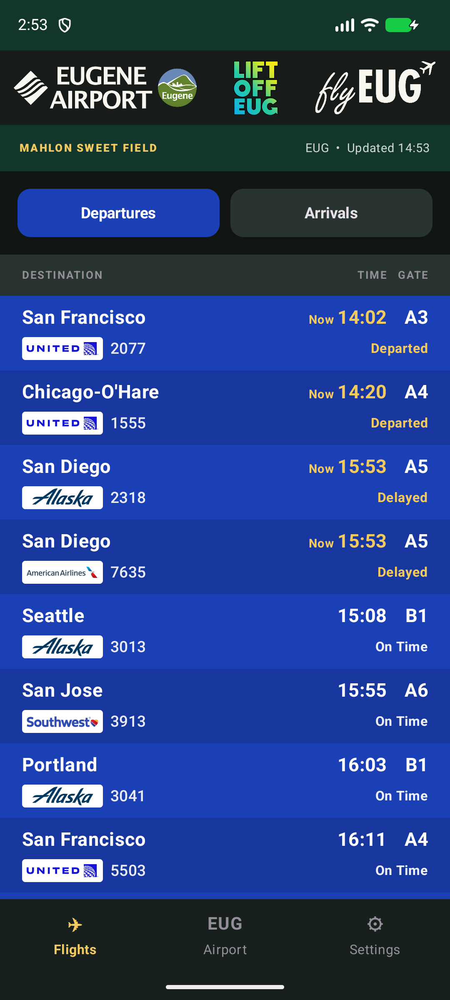
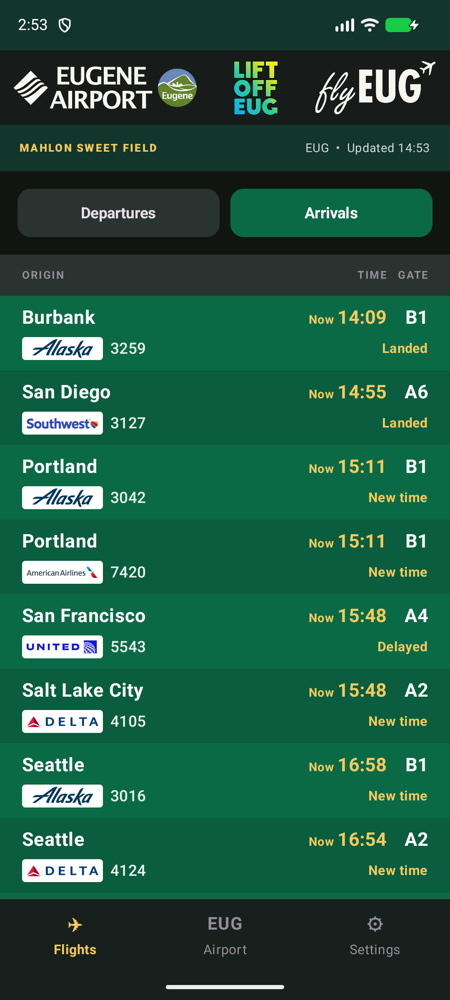
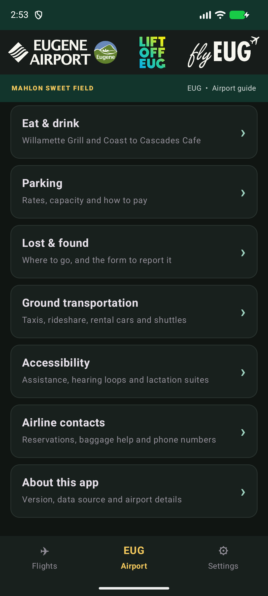
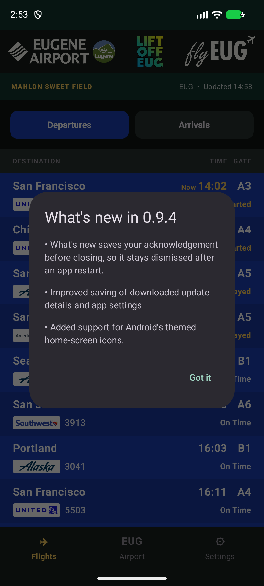

# Eugene Airport Android app

A free, unofficial Eugene Airport companion with live arrivals, departures, airport information, and food and drink menus.

**[Download EUG Airport 0.9.4 comparison build](https://github.com/Brusko25/Eugene-Airport-Releases/releases/download/v0.9.4/EUG-Airport-v0.9.4-debug.apk)**

> **Latest verified build: 0.9.4.** The ordinary in-app update from 0.9.3 passed Play Protect on the test Pixel 8a (SAFE, installation allowed), preserved settings and installed the exact published APK. This comparison moves the two unchanged launcher-icon source files; it did not reproduce the earlier block. [Previous 0.9.3](https://github.com/Brusko25/Eugene-Airport-Releases/releases/tag/v0.9.3) remains available.

## Screenshots

Actual 0.9.4 running in an isolated Android emulator with live public flight data. Times and details can change. Click an image for full size. The What's new themed-icon bullet is deliberately stale: themed-icon support remains absent, and the old bullet is retained to keep this comparison limited to file locations and version identifiers.

| Departures | Arrivals |
| --- | --- |
|  |  |

| Airport guide | What's new |
| --- | --- |
|  |  |

## Install on your Android phone

1. Tap the download link on your Android phone.
2. When it finishes, open the downloaded file.
3. If Android asks, allow your browser to install this app, then tap **Install**.
4. Open **EUG Airport**.

Already have it? Install the update over the existing app; you do not need to uninstall.
These are debug-signed testing builds for Android 8.0 and newer, distributed outside
Google Play. Follow any Android installation or security prompts.

## Updates and What's new

Versions **0.8 and newer** check for a newer release when you open the app. Tap **Update** to
download it inside EUG Airport, then follow any Android confirmation screens. On first
use Android asks you to allow EUG Airport to install its updates. Update notifications
are optional; they provide an easy way to reopen the app if Android closes it.

What's new appears once after each new version is installed. You can read it again
under **Settings → App updates → What's new**.

If you still have **0.6 or 0.7**, use **Settings → App updates** to download 0.8 through
your browser once. Future updates initiated from 0.8 can use the new in-app flow.

[Latest release and notes](https://github.com/Brusko25/Eugene-Airport-Releases/releases/latest)

> This is an unofficial prototype. Always confirm flight information with your airline.

## Previous versions and source

[Browse every release](RELEASES.md). Versions 0.3.0 and 0.4.0 have historical notes
only; their original releases did not include APKs. Versions 0.4.1 and newer include
Android downloads.

This public repository contains releases and documentation. Application source is
maintained separately in the private `Eugene-Airport-Code` repository. To install,
choose an APK. GitHub's automatic Source code ZIP and tar.gz contain only this public
repository's documentation.
