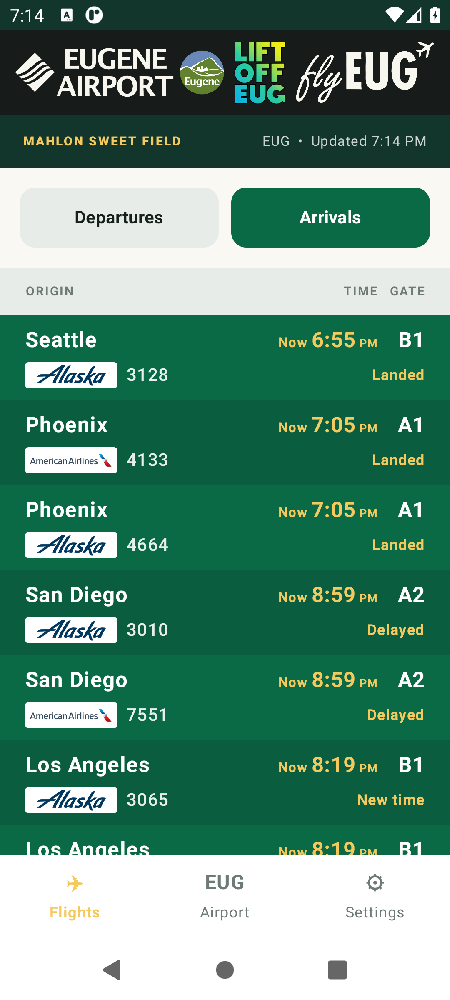
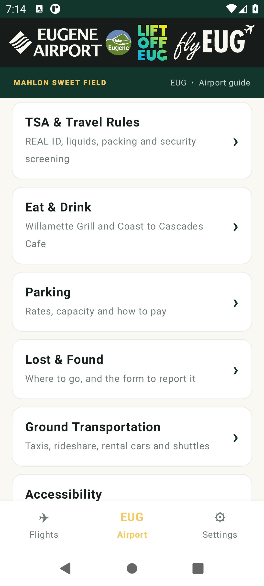
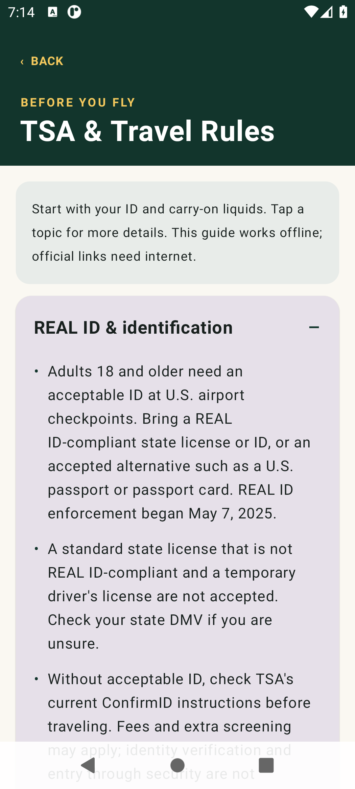
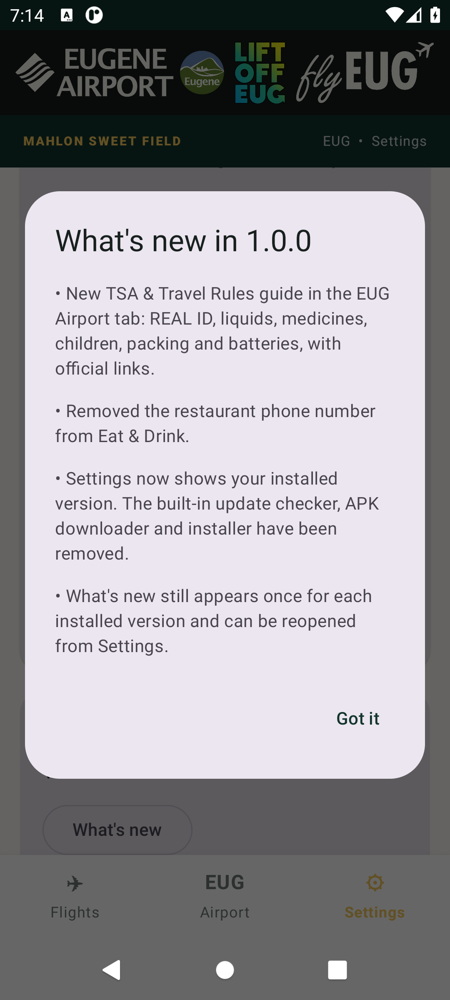

# Eugene Airport Android app

A free, unofficial Eugene Airport companion with live arrivals and departures,
airport information, food and drink menus, and TSA travel guidance.

**[Download EUG Airport 1.0.0 for Android](https://github.com/Brusko25/Eugene-Airport-Releases/releases/download/v1.0.0/EUG-Airport-v1.0.0-debug.apk)**

Android 8.0 or newer. This is a GitHub testing build distributed outside Google Play.

## Screenshots

Actual version 1.0.0/code 19 in an isolated Android 11 emulator, with live public
flight data. Times and details shown are from the capture and can change. Click
an image for full size.

| Arrivals | Airport guide |
| --- | --- |
|  |  |

| TSA & Travel Rules | What's new |
| --- | --- |
|  |  |

## Install on your Android phone

1. Tap **Download EUG Airport 1.0.0** above.
2. Open the downloaded APK file.
3. If Android asks, allow your browser to install this app, then tap **Install**.
4. Open **EUG Airport**.

Already have a previous GitHub version? Install this APK over the existing app;
you normally do not need to uninstall. It uses the same development signing key.
Follow Android's installation and security prompts.

## What's new in 1.0

- TSA & Travel Rules: offline guidance about REAL ID, liquids, medicines,
  children, packing, batteries and screening, with official TSA/FAA links.
- Portrait layout on phones, larger-text improvements and scrollable flight details.
- Navigation stays on the current page when Android recreates the app screen.
- Updated airport menu capitalization and removed the Eat & Drink phone number.
- Settings displays the current version. The built-in updater and installer are removed.
- What's new still appears once per installed version and is available again in Settings.

## Getting future updates

**Version 1.0 does not check for or install updates inside the app.** Return to the
[latest release page](https://github.com/Brusko25/Eugene-Airport-Releases/releases/latest)
and install a newer APK manually when one is available.

Google Play publication is planned separately. This GitHub installation is not a
Play Store installation; Play-managed updates will require the future Play version.

## Testing and known limitations

All 50 local emulator configurations passed their eight checks (400 test executions),
and 13 unit tests passed. The same APK was installed on a Pixel 8a through ADB with
saved settings preserved. These are emulator configurations, not 50 physical models;
the checks do not establish a new Play Protect verdict or Play Store approval.

On an offline cold start, the header may still say Connecting alongside the correct
flight-service error and retry button. TSA guidance works offline; official links
need internet. Portrait requests can be overridden by Android on large displays.

This is an unofficial prototype. Always confirm flight information with your airline
and current travel requirements with the linked official sources.

## Previous versions and source

[Release notes and checksum](https://github.com/Brusko25/Eugene-Airport-Releases/releases/tag/v1.0.0)
· [Browse release history](RELEASES.md).

Historical downloads are preserved. Version 0.9.5 and other withdrawn comparisons
remain withdrawn; their history and the earlier 0.9.4 phone result are in the release index.

This public repository contains release documentation, screenshots and APK assets.
Application source is maintained in the private Eugene-Airport-Code repository.
To install the app, choose the APK. GitHub's automatic Source code ZIP and tar.gz
contain only this public repository's documentation and images.
